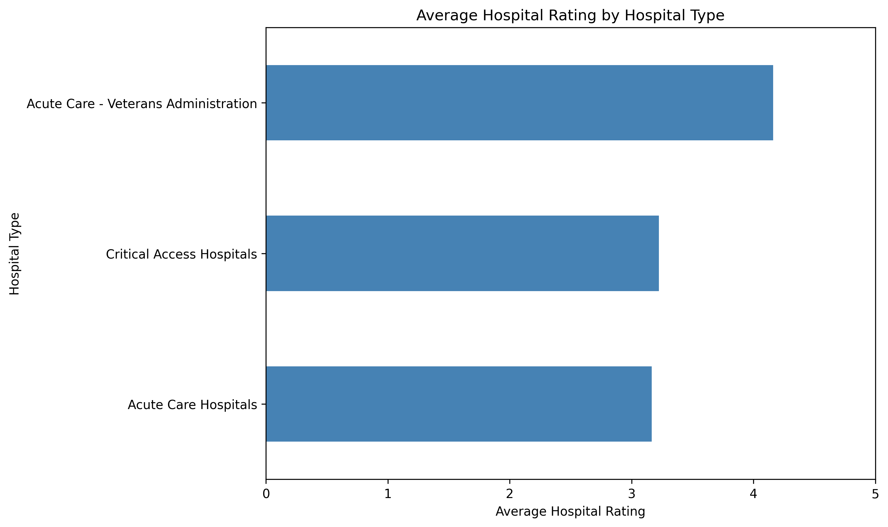
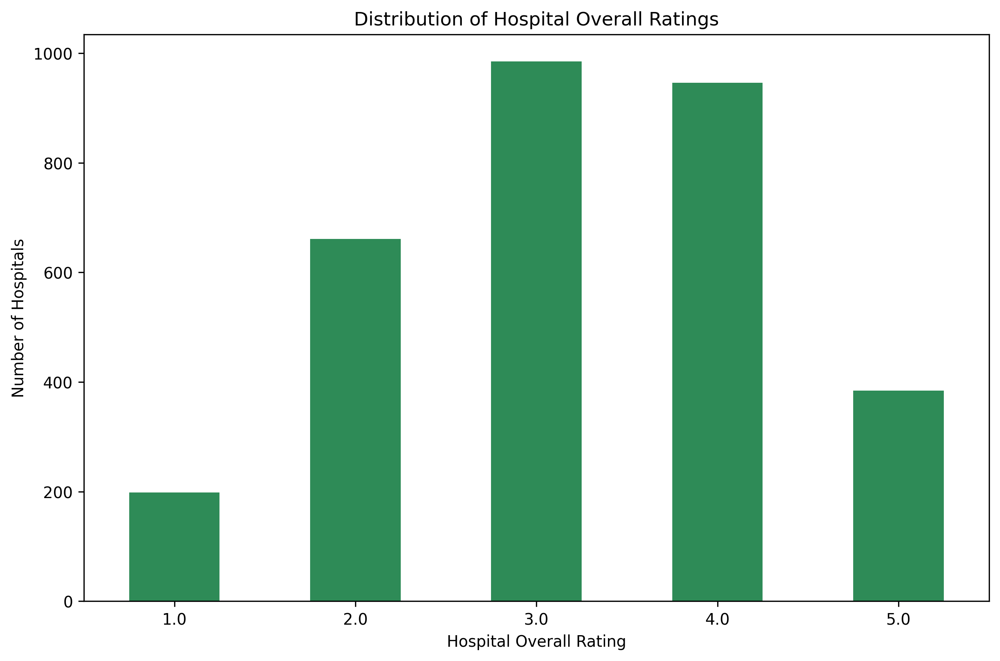
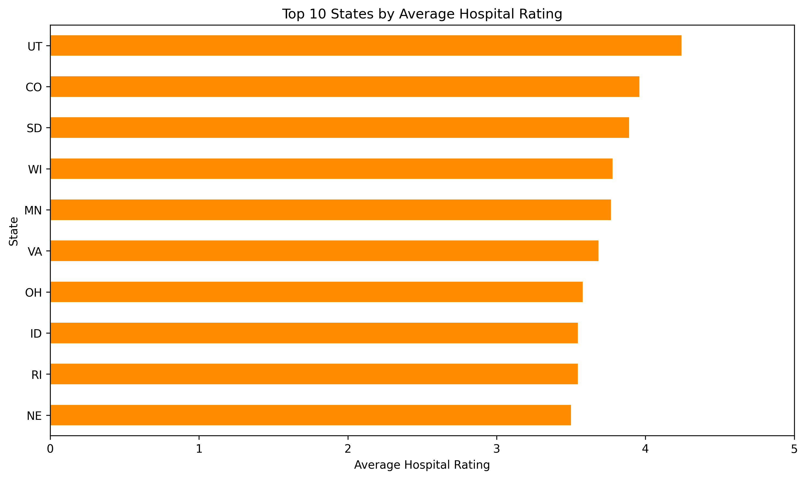

Healthcare Hospital Quality Analysis
Project Overview
This project analyzes publicly available hospital quality data to identify patterns in hospital ratings across hospital types, ownership structures, and geographic regions.

The project demonstrates practical skills in Python, pandas, data cleaning, exploratory data analysis, and data visualization.

Business Question
How do hospital quality ratings vary across different types of hospitals, ownership structures, and states?

A secondary objective was to evaluate the completeness of hospital rating data before drawing conclusions from the analysis.

Dataset
The analysis uses the Hospital General Information dataset containing information about hospitals, including:

Hospital type
Hospital ownership
State
Overall hospital rating
Mortality measures
Patient experience measures
Safety measures
Readmission measures
Timeliness of care measures
The dataset contains 5,419 hospital records and 38 variables.

Tools Used
Python
pandas
Matplotlib
Jupyter Notebook / Google Colab
GitHub
Analysis Performed
1. Data Quality Assessment
The dataset was evaluated for:

Missing values
Duplicate records
Rating availability
Data completeness
There were no duplicate hospital records.

A significant portion of hospitals did not have an available overall rating. Of the 5,419 hospitals, 2,245 were listed as "Not Available," representing approximately 41.4% of the dataset.

Because of this limitation, analyses of average hospital ratings excluded records without an available rating.

2. Hospital Ratings by Hospital Type
Average ratings were compared across hospital types.

Among hospital types with available ratings:

Veterans Administration acute care hospitals had an average rating of approximately 4.16.
Critical Access Hospitals had an average rating of approximately 3.22.
Acute Care Hospitals had an average rating of approximately 3.16.
Hospital types without sufficient rated records were not interpreted as having poor performance.

3. Hospital Ratings by Ownership
Average hospital ratings were also compared across ownership categories.

The analysis found variation across ownership structures. Tribal hospitals had the highest average rating among the ownership categories, approximately 4.33, but this category contained only three rated hospitals.

Veterans Health Administration hospitals averaged approximately 4.16, while proprietary hospitals averaged approximately 2.79.

These results should be interpreted cautiously because the number of hospitals varies considerably between ownership categories.

4. Geographic Analysis
Hospital ratings were compared across states.

The ten states with the highest average ratings in this analysis were:

Utah
Colorado
South Dakota
Wisconsin
Minnesota
Virginia
Ohio
Idaho
Rhode Island
Nebraska
State-level comparisons should be interpreted cautiously because hospital type, ownership, patient population, hospital size, and rating availability may differ between states.

Key Findings
The analysis identified meaningful variation in hospital ratings across hospital types, ownership structures, and states.

However, the availability of ratings is an important limitation. Approximately 41.4% of hospitals in the dataset did not have an available overall rating.

This demonstrates why healthcare analytics requires both quantitative analysis and careful evaluation of data quality before drawing conclusions.

Visualizations
Average Hospital Rating by Hospital Type

Distribution of Hospital Overall Ratings

Top 10 States by Average Hospital Rating

Skills Demonstrated
Python
pandas
Data cleaning
Missing-data analysis
Exploratory data analysis
GroupBy and aggregation
Data filtering
Healthcare data analysis
Matplotlib visualization
Statistical interpretation
Data-quality assessment
Communicating analytical findings
Limitations
This analysis is descriptive and does not establish causal relationships between hospital characteristics and quality ratings.

Average ratings may also be influenced by differences in hospital type, size, patient population, ownership, geographic location, and availability of ratings.

Further analysis could incorporate individual quality measures such as mortality, readmissions, patient experience, safety, and timeliness of care.

Author
Healthcare analytics portfolio project demonstrating practical application of Python and data analysis to a healthcare dataset.
